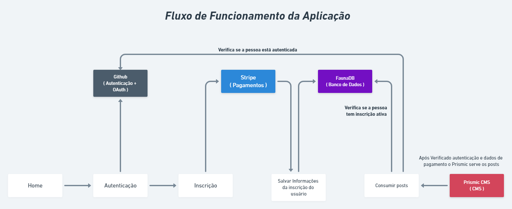

<!-- Logotipo -->
<div align="center">
  
</div>

<!-- Title -->
<h1 align="center"> Rocketseat 🔥 Ignite ReactJS </h1>

<!-- Preview -->
<div align="center">
  
</div>

<!-- Sobre o Projeto -->
## 🧐 Sobre o Projeto
Ig.News é uma aplicação que disponibiliza Artigos (posts) sobre variados assuntos.

Desenvolvida em React / Next, o login da aplicação é feito pela rede social Github.

Os artigos são armazenados no CMS Prismic e só podem ser acessados mediante assinatura mensal.

A assinatura mensal é feita por meio da API de pagamentos Stripe.

Sem a assinatura, só é possível visualizar uma prévia dos artigos.

A aplicação possui 2 páginas: Home e Posts.

Em Home, podemos assinar a assinatura mensal na API do Stripe.

Em Posts, acessamos os artigos.

## 📖 Conceitos aplicados a esse projeto

- Renderização de página
  - Client Side Rendering (CSR; as informações são carregadas a partir de alguma ação do usuário; quando não necessita de indexação no Google)
  - Server Side Rendering (SSR; as informações do html são atualizadas em tempo real; é diferente para cada usuário; quando necessita de indexação no Google)
  - Static Site Generation (SSG; mesmo html compartilhado para todos os usuários, no qual as informações são atualizadas a cada tanto tempo determinado no código; quando necessita de indexação no Google)
- API Routes (são executadas utilizando o conceito de Serveless, no qual as rotas não criam um servidor 24 horas rodando que nem com Axios, só sobe e desce os ambientes conforme elas são chamadas)
- Estratégias de autenticação
  - JWT (salvo no storage; tem data de expiração)
  - Next Auth (sistema simples; independe do back end; tem data de expiração; utilizado quando necessita fazer login com algum sistema social, por exemplo Facebook ou GitHub; utilizado quando não se quer armazenar credenciais de acesso do usuário; informações ficam armazenadas nos cookies)
  - Cognito, Auth0 (providers de autenticação externa; integram com o Next Auth; armazenam dados do usuário)
- JAMStack (JavaScript API Markup; conceito de aplicações completas que dependem menos de um back end)
- CMS (Content Management System; projetos com painel de administração pronto e é possível criar conteúdo dentro; exemplo Wordpress. Drupal, Joomla, Magento)
- Headless CMS (Painel de administração + API HTTP, GraphQL, SDK; exemplo Strapi, Ghost, Keystone, GraphCMS, Prismic CMS, Contentful, Shopify, Saleor)

## 👇 Fluxo da Aplicação


## 🚀 Tecnologias e Bibliotecas
* [Next.js](https://nextjs.org/)
* [Next Auth](https://next-auth.js.org/): Sistema de autenticação para realizar o sistema de login com as API Routes
* [ReactJS](https://reactjs.org/)
* [TypeScript](https://www.typescriptlang.org/)
* [Prismic](https://prismic.io/): Plataforma de CMS que contém os conteúdos dos posts que serão consumidos no código com sua API.
* [Stripe](https://stripe.com/en-br): Plataforma de pagamentos online, no qual foi utilizado sua API para realização das inscrições.
* [Faunadb](https://fauna.com/): Banco de dados recomendado para funções Serveless.
* [SASS](https://sass-lang.com/)

## 💻 Rodando o Projeto

```
# Abra um terminal e copie este repositório com o comando
$ git clone https://github.com/lucasbarque/ig-news.git

# Acesse a pasta da aplicação
$ cd ig-news

# Crie um arquivo .env.local e coloque as variaveis
# de ambiente baseado no arquivo .env.example 

# Instale as dependências
$ yarn

# Inicie a aplicação
$ yarn start

```
© 2022 GitHub, Inc.
Terms
Privacy
Security
Stat